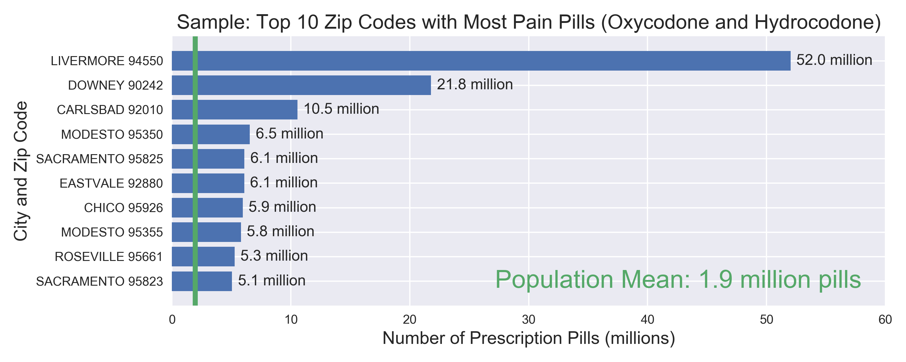
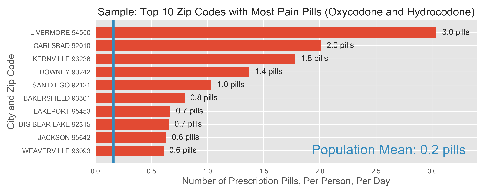

# arcos-ca

Collection of total number of pills per zip code.
* Data Source: [The Washington Post](https://www.washingtonpost.com/graphics/2019/investigations/dea-pain-pill-database/#download-resources)
* Updated: July 21, 2019

# census

* Data Source: [California Department of Finance](http://www.dof.ca.gov/Reports/Demographic_Reports/Census_2010/)
* Generated: August 25, 2011

# income

* Data Source: [Internal Revenue Service](https://www.irs.gov/statistics/soi-tax-stats-individual-income-tax-statistics-zip-code-data-soi)

# analysis

If income and pill saturation are related, then concentrations greater than 0.2 pills per person per day and incomes greater than $40,000 will yield higher death rates.
* Population Mean = 0.2 pills per person per day.
* $40,000 is the 22%, 2019 tax bracket for unmarried individuals.

