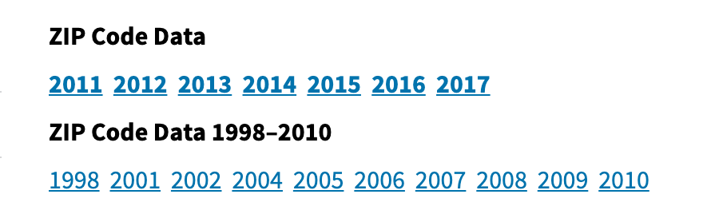

# Data Collection

* Source: [Internal Revenue Service](https://www.irs.gov/statistics/soi-tax-stats-individual-income-tax-statistics-zip-code-data-soi)

## Individual Income Tax ZIP Code Data

# Final Analysis

